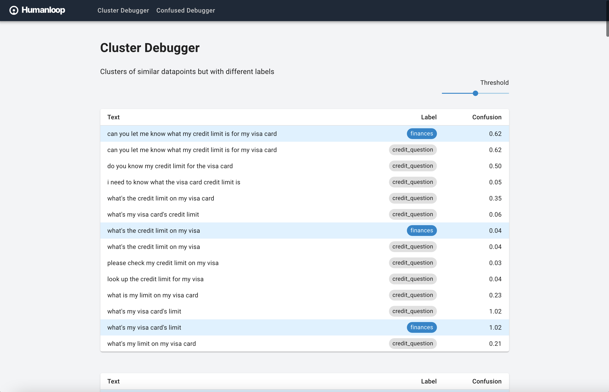
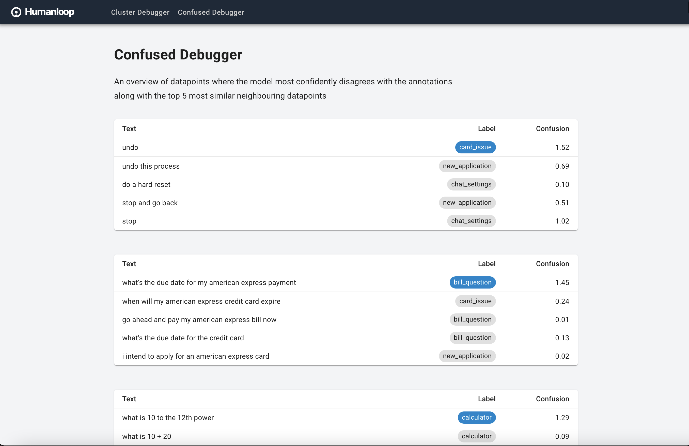

# Humanloop Data Debugger

A prototype for debugging a dataset labeled using Humanloop.
It contains two debuggers: Cluster Debugger and Confused Debugger.

## Cluster Debugger
The Cluster Debugger shows clusters of similar data-points (based on a dense embedding of the text/sentence) with different labels within the cluster.



## Confused Debugger
The Confused Debugger lists the most confused data-points by the currently trained Humanloop model and shows the top 5 most similar data-points with labels.



## Run

Docker is required to run this project.
The following command setups the backend, frontend, and database (MongoDB).

```shell
docker-compose up
```

The web app can then be accessed at <http://localhost:3000>